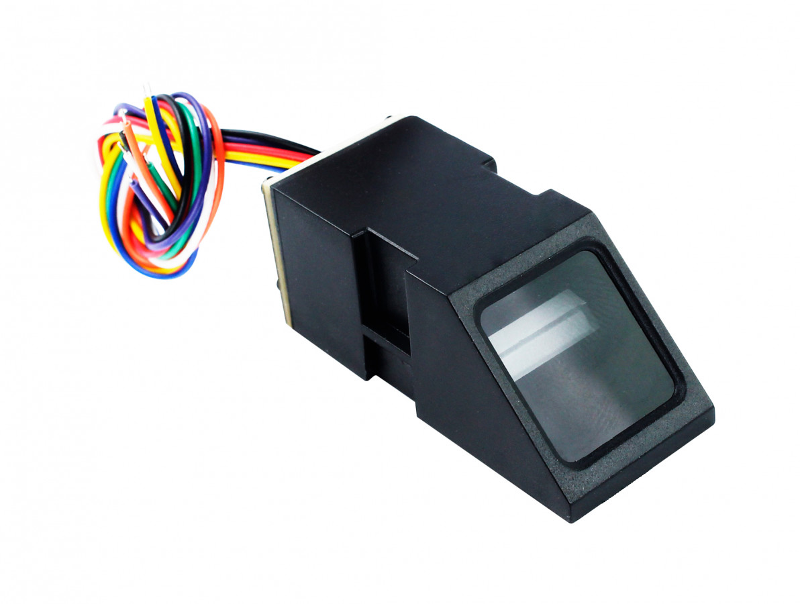
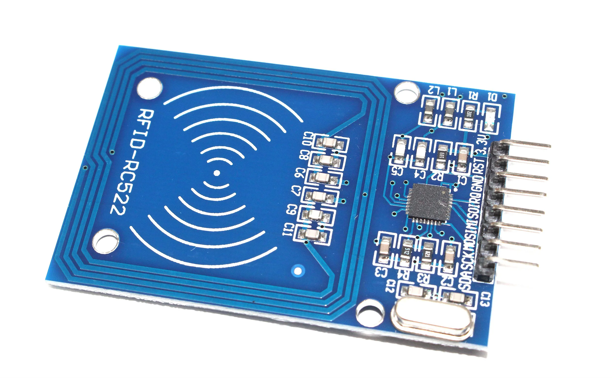
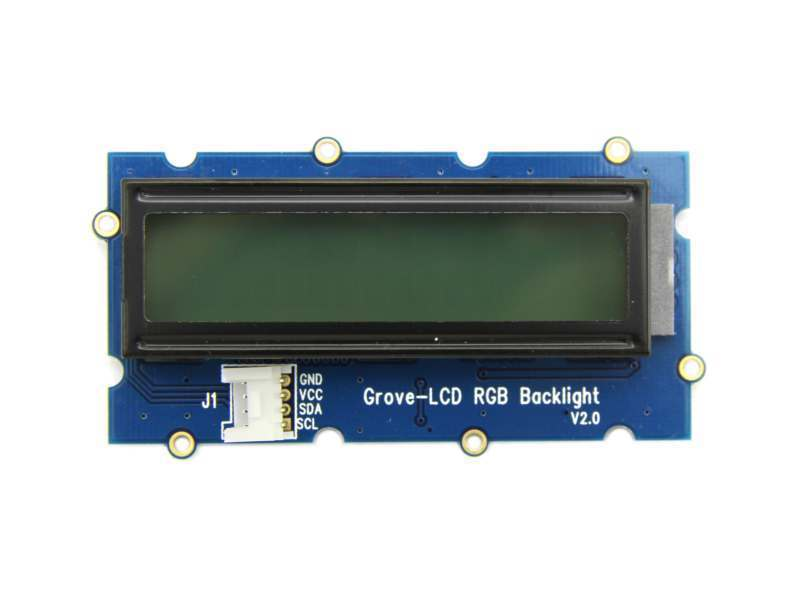
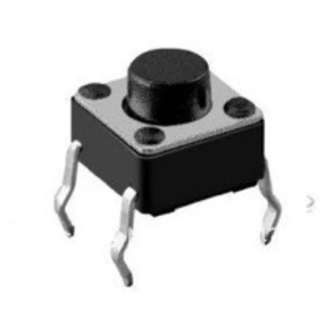
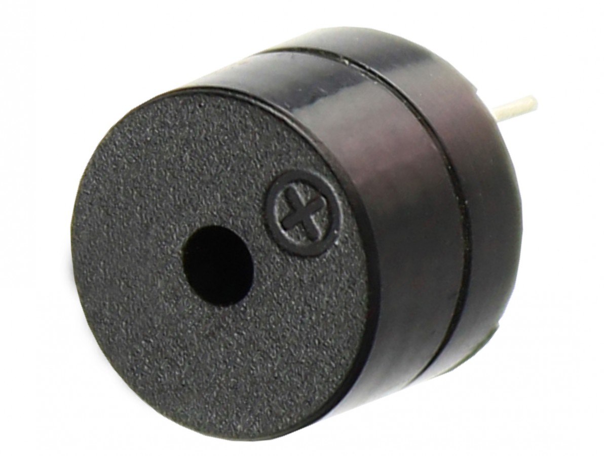
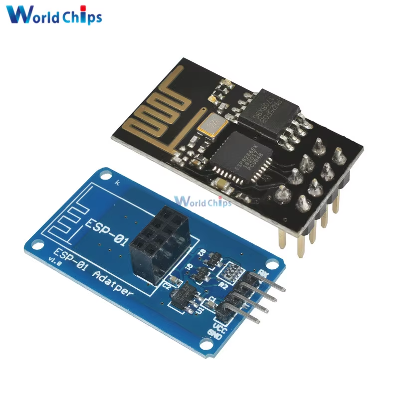
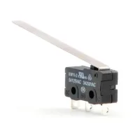
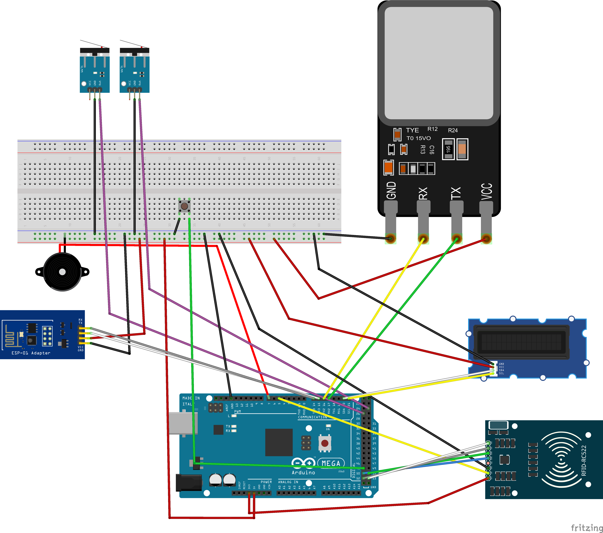

# SCCI - Sistema de Controle de Acesso e Monitoramento de Chaves

> **Status:** Finalizado (v1.0)
> **Plataforma:** Arduino Mega 2560 + ESP8266

Este projeto consiste em um sistema embarcado robusto para o gerenciamento seguro de retirada e devolução de chaves. O sistema utiliza autenticação híbrida (**Biometria e RFID**), possui interface visual com **LCD RGB**, e realiza o log de todos os eventos em tempo real para um banco de dados **Google Firebase** via Wi-Fi.

## Funcionalidades Principais

* **Autenticação Híbrida:** Acesso via Impressão Digital (Sensor Óptico) ou Cartão RFID (MFRC522).
* **Monitoramento de Chaves:** Sensores nos ganchos detectam instantaneamente a retirada ou devolução.
* **Cadastro Inteligente:**
  * Modo de cadastro ativado por botão físico.
  * **Dupla Verificação Biométrica:** Garante que a digital foi lida corretamente duas vezes antes de salvar.
  * **Alocação Dinâmica de Memória:** Busca automática por IDs livres, evitando sobrescrita acidental de usuários.
* **Conectividade IoT:** Envio de logs (Quem retirou, Qual chave, Horário, Evento) para o Firebase via ESP8266.
* **Feedback Visual e Sonoro:** Display LCD RGB com cores semânticas (Verde=Sucesso, Vermelho=Erro, Laranja=Cadastro) e Buzzer para alarmes.
* **Proteção de Hardware:**
  * **Watchdog de LCD:** Reset preventivo do controlador do display para evitar caracteres corrompidos por ruído elétrico.
  * **Alarme Antifurto:** Dispara sirene caso uma chave seja retirada sem autenticação prévia.

---

## Cronograma de Desenvolvimento

O projeto foi desenvolvido ao longo de 3 semanas intensivas, seguindo um cronograma de implementação modular e testes de integração.

| Data            | Dia    | Atividades Realizadas                                                                                                                                                                                                                            |
| :-------------- | :----- | :----------------------------------------------------------------------------------------------------------------------------------------------------------------------------------------------------------------------------------------------- |
| **25/11** | Terça | • Definição da arquitetura do hardware. • Implementação inicial do módulo**RFID (MFRC522)** e testes de leitura/escrita na EEPROM.                                                                                                  |
| **26/11** | Quarta | • Integração do**Sensor Biométrico (AS608)**. • Criação da lógica básica de cadastro e comparação de digitais. • Configuração inicial do Display LCD RGB.                                                                   |
| **02/12** | Terça | • Implementação da conectividade**Wi-Fi (ESP8266)**. • Configuração do protocolo AT Commands e testes de conexão HTTPS com o **Google Firebase**.                                                                             |
| **03/12** | Quarta | • Desenvolvimento da lógica de**Monitoramento das Chaves** (Painel). • Integração dos sistemas (Autenticação -> Liberação -> Log). • Implementação do sistema de Alarme.                                                |
| **09/12** | Terça | • Refinamento da interface (UX) no LCD (Cores e Mensagens). • Otimização do envio de JSON e tratamento de*debounce* nos sensores.                                                                                                          |
| **10/12** | Quarta | •**Correção Crítica:** Implementação da busca de IDs livres na memória do sensor (solução de bug de sobrescrita). • Adição da **Dupla Checagem** no cadastro biométrico. • Implementação do reset preventivo do LCD. |
| **12/12** | Sexta  | • Montagem final e organização dos cabos. • Testes de estresse (Watchdog, quedas de energia, Wi-Fi instável). •**Finalização e Entrega do Projeto.**                                                                               |

---

## Hardware Utilizado

* **Microcontrolador:** Arduino Mega 2560
* **Autenticação:**

  * Sensor Biométrico (AS608 / R307)
  * Leitor RFID (RC522 - 13.56MHz)

  

  
* **Interface:**

  * Display Grove LCD RGB 16x2 (I2C)
  * Botão Push-button (Modo Cadastro)
  * Buzzer/Sirene 5V

  

  

  
* **Conectividade:**

  * Módulo Wi-Fi ESP8266 (ESP-01)

  
* **Sensores:**

  * Chaves Fim de Curso

  
* **Alimentação:**

  * Fonte Externa 12V 2A

## Diagrama Fritizing

## Pinagem (Esquemático Simplificado)

| Componente            | Pino Arduino Mega             | Detalhes          |
| :-------------------- | :---------------------------- | :---------------- |
| **Biometria**   | **16 (TX2) / 17 (RX2)** | Serial Hardware 2 |
| **RFID**        | **50, 51, 52, 53**      | Barramento SPI    |
| **RFID (RST)**  | **5**                   | Reset             |
| **Wi-Fi (ESP)** | **14 (TX3) / 15 (RX3)** | Serial Hardware 3 |
| **Chaves**      | **25, 26 ...**          | Pull-up Interno   |
| **Botão Cad.** | **48**                  | Pull-up Interno   |
| **Alarme**      | **7**                   | Saída Digital    |
| **LCD**         | **SDA / SCL**           | Barramento I2C    |

---

## Bibliotecas Necessárias

Para compilar o código, instale as seguintes bibliotecas na Arduino IDE:

1. `Adafruit Fingerprint Sensor Library`
2. `MFRC522`
3. `Grove - LCD RGB Backlight` 
4. `SPI` & `Wire` (Nativas)
5. `EEPROM` (Nativa)

## Como Utilizar

1. **Inicialização:** Ao ligar, o sistema exibe no Monitor Serial o relatório de memória (quantas digitais e tags estão salvas).
2. **Modo Cadastro:**
   * Pressione o botão físico (Pino 48).
   * O LCD ficará **Laranja**.
   * Aproxime uma Tag RFID (cadastro instantâneo) OU coloque o dedo no sensor biométrico.
   * *Biometria:* Siga as instruções do LCD (Colocar, Tirar, Confirmar).
3. **Uso Diário:**
   * Usuário se autentica.
   * LCD fica **Verde** ("Pode retirar").
   * Usuário retira a chave -> Log enviado ao Firebase.
   * Usuário devolve a chave -> Log enviado ao Firebase.

---

## Autores

**Davi Greco** *Universidade Federal de São João Del Rei (UFSJ)*

**André Lima** *Universidade Federal de São João Del Rei (UFSJ)*

---

Link dos Vídeos: https://drive.google.com/drive/folders/1K8cHlKkT1FUWWtvSnVYrWRfe4uAF3PfO
